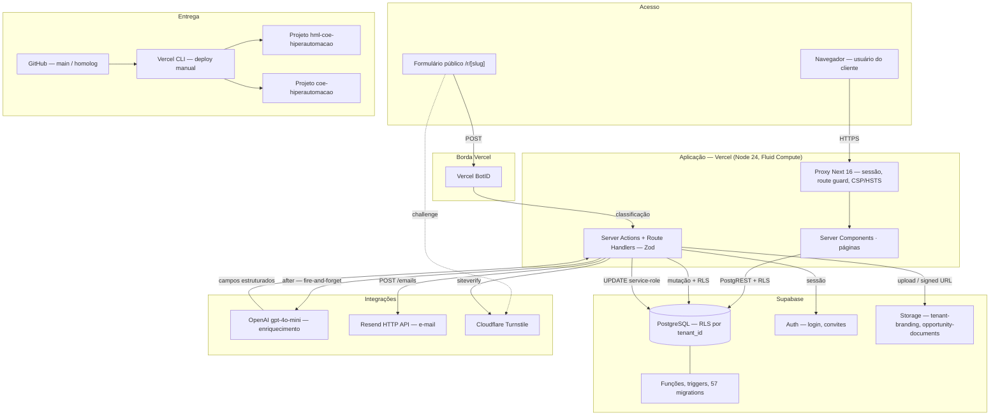

# Briefing para IA — Diagrama de Arquitetura do CoE de Hiperautomação

Documento de **instrução para uma IA** (geradora de imagem, de HTML/SVG, de Mermaid ou de slide)
produzir o diagrama de arquitetura desta plataforma. Contém a *fonte da verdade técnica*
(verificada no código em 2026-08-17), as **regras de topologia** que o desenho não pode violar,
o padrão visual e um checklist de aceite.

> Regra zero: **o diagrama descreve o sistema, não a lista de logos.** Se um item da fonte da
> verdade não puder ser posicionado com uma seta que faça sentido, ele não entra.

---

## 1. Como usar este arquivo

Cole o conteúdo inteiro no prompt da IA, precedido de:

> "Gere o diagrama de arquitetura descrito abaixo. Siga a seção 4 (topologia) à risca — a direção
> das setas é o conteúdo principal do desenho. Use a seção 6 como referência de layout e a seção 7
> como padrão visual. Ao final, verifique o resultado contra o checklist da seção 9 e liste o que
> não conseguiu cumprir."

Formatos aceitos, em ordem de preferência:

| Formato | Quando usar | Observação |
|---|---|---|
| **HTML + SVG inline** (1 arquivo) | Padrão. Diagrama que precisa ser editável e legível em zoom | Texto vira texto de verdade, não pixels |
| **Mermaid** | Versão para docs/README e revisão rápida de topologia | Base pronta na seção 8 |
| **Imagem raster (PNG)** | Só para slide/apresentação | Risco alto de texto deformado; revisar cada rótulo |

---

## 2. Público e mensagem

- **Público:** stakeholders técnicos do cliente (FGCoop) e time da PSW. Nível "arquitetura de
  solução", não "diagrama de classes".
- **Mensagem em uma frase:** *aplicação Next.js na Vercel, com Supabase como plataforma de dados
  (Postgres + Auth + RLS + Storage), integrações server-side com OpenAI e Resend, e dois ambientes
  totalmente isolados.*
- **Idioma:** pt-BR nos rótulos; nomes de produto e de código em inglês (`tenant_id`, `RLS`, `App Router`).

---

## 3. Fonte da verdade — inventário verificado

Tudo abaixo foi conferido no repositório `pswdigital-tech/coe-hiperautomacao`. **Não inventar,
não completar com itens "típicos de stack" que não estejam nesta lista.**

### 3.1 Aplicação (roda na Vercel)

| Item | Valor real | Evidência |
|---|---|---|
| Framework | **Next.js 16.2.6** — App Router, Server Components por padrão, Server Actions para mutação | `package.json`, `docs/PROJETO.md` |
| UI | **React 19.2.4**, **Tailwind CSS v4**, **@dnd-kit** (kanban) | `package.json` |
| Linguagem | **TypeScript 5** estrito | `tsconfig.json` |
| Validação | **Zod 4** (schemas do wizard, do formulário público e das saídas da IA) | `package.json`, `lib/ai/schema.ts` |
| Interceptação de request | **Proxy do Next 16** (`proxy.ts`, substitui o antigo `middleware.ts`) — refresh de sessão + route guard + headers de segurança | `proxy.ts` |
| Runtime | Vercel Functions (Node.js 24.x, Fluid Compute) | `vercel project inspect` |
| Testes | **Vitest 3** + Testing Library + jsdom, com suíte dedicada de segurança/isolamento | `vitest.config.ts`, `tests/` |

### 3.2 Dados (Supabase)

| Componente | Uso real |
|---|---|
| **PostgreSQL** | Schema de domínio; **57 migrations SQL versionadas** em `supabase/migrations/` |
| **Auth** | Login por e-mail/senha, convites, recuperação de senha |
| **RLS multi-tenant** | Toda tabela de domínio tem `tenant_id` + 4 policies (select/insert/update/delete) via helper `current_tenant_id()`. É o mecanismo de isolamento — não há schema por tenant |
| **Funções, triggers e colunas GENERATED** | `opportunity_score()`, trigger de sincronia de fases, `rpa_score`, prioridade de risco pela matriz impacto × probabilidade |
| **Storage** | 2 buckets: `tenant-branding` (logo do cliente, público) e `opportunity-documents` (anexos e imagens inline, privado com policies) |

Papéis do modelo de acesso (aparecem só na versão técnica do diagrama, se houver espaço):
`member` / `viewer` / `tenant_admin` (cliente) · `psw_staff` (PSW, por atribuição) ·
`platform_admin` (super-admin de plataforma, cross-tenant).

### 3.3 Integrações externas — **chamadas pelo servidor Next.js, nunca pelo Supabase**

| Integração | Como é usada de fato |
|---|---|
| **OpenAI** | SDK `openai` v6, modelo `gpt-4o-mini`, structured outputs validados por Zod. Enriquecimento de oportunidade disparado em *fire-and-forget* pelo `after()` do Next dentro da Server Action; a gravação do resultado volta ao Postgres pelo client **service-role**, filtrando `id + tenant_id + status='pending'`. `lib/ai/enrichment.ts` |
| **Resend** | E-mail transacional (convites de usuário). **Sem SDK** — `POST` direto em `https://api.resend.com/emails`. Chave injetada pela integração do Vercel Marketplace. `lib/email/send.ts` |
| **Cloudflare Turnstile** | Captcha invisível no formulário público `/r/[slug]`: widget no browser (`@marsidev/react-turnstile`) + `siteverify` server-side, token de uso único. `lib/security/turnstile.ts` |
| **Vercel BotID** | Classificador de bot na borda, protegendo o `POST` do formulário público. `withBotId()` em `next.config.ts` + `initBotId()` em `instrumentation-client.ts` |

### 3.4 Segurança (camadas, não uma caixa de ícones)

1. **Borda Vercel** — BotID.
2. **Proxy do Next 16** — sessão Supabase, route guard e headers: CSP, HSTS (`max-age=63072000; includeSubDomains; preload`), `X-Frame-Options: DENY`, `X-Content-Type-Options`, `Referrer-Policy`, `Permissions-Policy`.
3. **Server Action** — Zod + verificação de papel + Turnstile.
4. **Banco** — RLS por tenant, RPC `SECURITY DEFINER` com limites de tamanho, trilha de auditoria (`audit_log`).

> No formulário público as 4 camadas atuam em série. Se o diagrama tiver uma seção de segurança,
> represente-as **como um fluxo em série**, não como uma grade de selinhos.

### 3.5 Ambientes e deploy

| Fato | Estado hoje |
|---|---|
| Repositório | GitHub `pswdigital-tech/coe-hiperautomacao`, branches `main` e `homolog` |
| Projeto Vercel de produção | `coe-hiperautomacao` (domínio do cliente é **alias manual**) |
| Projeto Vercel de homologação | `hml-coe-hiperautomacao` (criado em 2026-08-17) |
| Isolamento | Projetos Vercel separados, com env vars e secrets próprios |
| **Git integration** | **NÃO conectada em nenhum dos dois projetos.** Push/merge não dispara build. O deploy é feito por CLI: `vercel deploy --prod` + `vercel alias set` |

**Consequência obrigatória para o diagrama:** ou o fluxo de deploy é desenhado como ele é
(CLI), ou a caixa "deploy automático a partir do PR" recebe rótulo explícito de **estado-alvo**
(tarja "planejado", linha tracejada). Não desenhar automação que não existe.

---

## 4. Topologia — regras inegociáveis

Estas regras existem porque a versão anterior do diagrama as violou.

1. **O centro é a aplicação Next.js na Vercel.** Todo tráfego externo passa por ela.
2. **OpenAI e Resend ligam-se à camada de aplicação, não ao Supabase.** O Supabase nunca chama
   OpenAI nem Resend. Seta correta: `App (Vercel) → OpenAI` e `App (Vercel) → Resend`.
3. O retorno da IA volta ao banco **pela aplicação**: `App → Postgres (service-role UPDATE)`.
4. **Supabase Storage é um componente de primeira classe** e precisa aparecer ao lado de
   Postgres/Auth/RLS.
5. **Turnstile e BotID são caminho de entrada**, não decoração: ficam entre o navegador e a
   Server Action do formulário público.
6. **Só existe um backend de aplicação**: as Server Actions e Route Handlers do Next rodando como
   Vercel Functions. Não desenhar uma caixa genérica "Backend" separada disso.
7. Toda seta é **direcionada e rotulada** com o que trafega (`SQL/PostgREST`, `HTTPS`,
   `siteverify`, `deploy`).

Arestas canônicas (usar exatamente estas):

```
Navegador          → App Next.js (Vercel)         : HTTPS
App Next.js        → Supabase Postgres            : PostgREST / SQL (anon + RLS)
App Next.js        → Supabase Auth                : sessão / convites
App Next.js        → Supabase Storage             : upload / signed URL
App Next.js        → OpenAI (gpt-4o-mini)         : enriquecimento (after(), fire-and-forget)
App Next.js        → Supabase Postgres            : UPDATE service-role pós-IA
App Next.js        → Resend HTTP API              : e-mail transacional
Navegador          → Cloudflare Turnstile         : challenge do widget
App Next.js        → Cloudflare Turnstile         : siteverify
Borda Vercel/BotID → App Next.js                  : classificação do POST público
Dev / CI (GitHub)  → Vercel CLI → Projeto Vercel  : deploy (hml e prod, separados)
```

---

## 5. O que NÃO fazer (erros da versão 1 do diagrama)

- ❌ Ligar OpenAI e Resend ao bloco do Supabase.
- ❌ Omitir o Supabase Storage.
- ❌ Mostrar "PR aprovada → deploy automático" como se estivesse ativo.
- ❌ Tratar "Homologação" e "Produção" só como caixas de ambiente sem dizer o que é isolado
  (projeto Vercel, projeto Supabase, env vars e secrets).
- ❌ Misturar o **pipeline de status das demandas** (Novo → Em Análise → … → Homologação →
  Produção → Concluído, que é *domínio de negócio*) com os **ambientes de deploy**. São coisas
  diferentes com os mesmos nomes; se ambos aparecerem, rotule sem ambiguidade.
- ❌ Colocar "Vitest" dentro do bloco de Segurança como se fosse um controle de runtime — é
  qualidade/CI.
- ❌ Painel de logos sem setas.
- ❌ Inventar Redis, fila, CDN própria, Docker, Kubernetes, rate limit — nada disso existe aqui
  (o rate limit por IP está explicitamente adiado no backlog).

---

## 6. Layout recomendado

Formato **16:9 horizontal**, 4 faixas de cima para baixo:

```
┌── Faixa 1 — Acesso ─────────────────────────────────────────────────────┐
│  Navegador (usuário do cliente)   ·   Formulário público /r/[slug]       │
└─────────────────────────────────────────────────────────────────────────┘
              │ HTTPS                          │ POST
              ▼                                ▼  [BotID → Turnstile]
┌── Faixa 2 — Aplicação (Vercel) ─────────────────────────────────────────┐
│  Next.js 16 App Router · React 19 · Tailwind v4 · TS                    │
│  Proxy (sessão + guard + CSP/HSTS)                                      │
│  Server Components · Server Actions (Zod) · Vercel Functions (Node 24)   │
└─────────────────────────────────────────────────────────────────────────┘
        │ PostgREST/SQL        │ HTTPS                 │ HTTPS
        ▼                      ▼                       ▼
┌── Faixa 3 — Dados ────────┐ ┌── Integrações ─────────────────────────────┐
│ Supabase                  │ │ OpenAI gpt-4o-mini — enriquecimento         │
│ Postgres · Auth · RLS     │ │ Resend HTTP API — e-mail transacional       │
│ Storage · Funções/Triggers│ │ Cloudflare Turnstile — captcha              │
│ 57 migrations             │ │ Vercel BotID — bot na borda                 │
└───────────────────────────┘ └────────────────────────────────────────────┘

┌── Faixa 4 — Entrega ────────────────────────────────────────────────────┐
│ GitHub (main / homolog) → Vercel CLI → [ hml-… ]   [ coe-… ]            │
│                                        Homologação  Produção            │
│ Isolados: projeto Vercel + projeto Supabase + env vars + secrets        │
└─────────────────────────────────────────────────────────────────────────┘
```

Regras de leitura: fluxo principal de cima para baixo, integrações à direita, entrega no rodapé.
Nenhuma seta cruzando faixa por trás de caixa.

---

## 7. Padrão visual

- **Paleta:** azul-marinho institucional PSW (`#1B2A6B` aprox.) para títulos e bordas de bloco;
  azul claro (`#3E7BFA`) para setas e destaques; cinza-claro (`#F4F6FA`) para fundo de bloco;
  branco para os cards internos; verde (`#12B76A`) só para o bloco de dados; roxo (`#7A5AF8`) só
  para integrações. Máximo de 5 cores com significado — cor é categoria, não enfeite.
- **Tipografia:** sem serifa (Inter/Manrope). Título 28–32px, títulos de bloco 16–18px, rótulo de
  card 13–14px, rótulo de seta 11–12px em itálico.
- **Cards:** cantos 8–12px, borda 1px, sombra sutil, respiro interno generoso.
- **Ícones:** monocromáticos, estilo linha, tamanho uniforme. Logo oficial só para produtos de
  terceiros (Next.js, Supabase, OpenAI, Resend, Vercel, Cloudflare, GitHub).
- **Marca:** logo PSW no canto superior esquerdo; título centralizado; subtítulo de uma linha.
- **Acessibilidade:** contraste mínimo AA; nenhuma informação transmitida só por cor — todo bloco
  colorido também tem rótulo textual.
- **Legenda obrigatória** quando houver linha tracejada (estado-alvo) ou tarja de isolamento.

---

## 8. Implementação de referência (Mermaid)

Topologia correta em forma verificável. Uma IA que gerar imagem deve usar isto como **contrato**;
uma IA que gerar docs pode usar direto.



---

## 9. Checklist de aceite

A IA deve verificar cada item e reportar o que não cumpriu.

- [ ] Nenhuma seta liga Supabase a OpenAI ou a Resend.
- [ ] Supabase Storage aparece com os dois buckets nomeados.
- [ ] Toda seta tem direção e rótulo.
- [ ] Enriquecimento por IA mostra o retorno gravando no Postgres **via aplicação**.
- [ ] Turnstile e BotID estão no caminho de entrada do formulário público.
- [ ] Deploy aparece como CLI, ou o fluxo automático está marcado como estado-alvo (tracejado + legenda).
- [ ] Homologação e Produção listam o que é isolado (projeto Vercel, projeto Supabase, env vars, secrets).
- [ ] Não há confusão entre status de demanda ("Homologação"/"Produção" do pipeline de negócio) e ambientes.
- [ ] Versões citadas conferem: Next 16.2.6, React 19.2.4, Tailwind v4, Node 24.x, `gpt-4o-mini`.
- [ ] Nenhum componente inventado (sem Redis, fila, Docker, K8s, rate limit).
- [ ] Todo texto legível a 100% de zoom; contraste AA; sem palavra cortada.
- [ ] Máximo de 5 cores com significado, e cada uma explicada na legenda.

---

## 10. Variantes

- **Executiva (1 slide):** só as faixas 2, 3 e 4, sem nomes de arquivo e sem papéis de acesso.
- **Técnica (documentação):** acrescentar papéis (`platform_admin`, `psw_staff`, `tenant_admin`,
  `member`, `viewer`), as 4 camadas de defesa do formulário público em série, e a nota de que o
  score de prioridade é **calculado, nunca persistido**.
- **Segurança (auditoria):** faixa única com as 4 camadas em série e os headers listados por nome.

---

*Fonte da verdade conferida no código em 2026-08-17. Ao mudar stack, integração ou ambiente,
atualize a seção 3 antes de regerar qualquer diagrama.*
